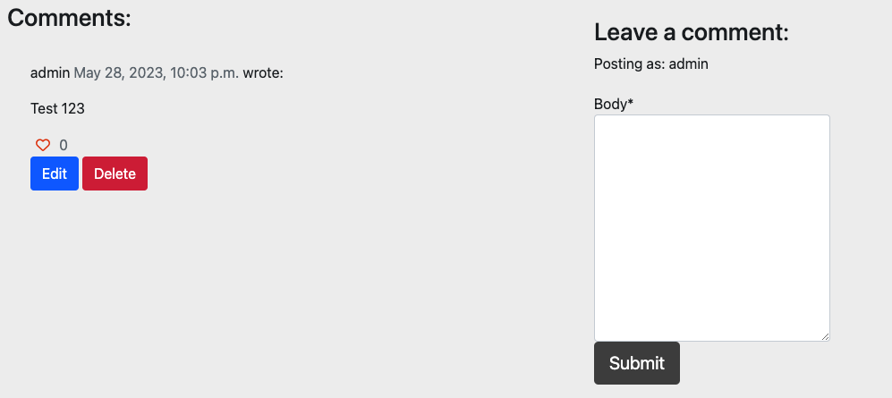

# The Simple Man Spirits

The Simple Man Spirits website is developed using the Django Framework as part of my Portfolio Project 4 for my Diploma in Full Stack Software Development at Code Institute.

The website focuses on cocktail recipes and spirits, catering to enthusiasts and beginners alike. Users can explore a wide range of cocktail recipes, learn about different spirits, and even discover tips and tricks for creating the perfect drink. The site provides a platform for users to view blog posts about various cocktails and leave comments to engage in discussions with other users.

When logged in, users have additional features such as the ability to like/unlike a cocktail recipe, leave comments on blog posts, and like/unlike comments.

You can visit the live site here: https://pp4-capell.herokuapp.com/ <br>
The Repository: https://github.com/CharlieApell/ProjectPortfolio4


***
## Table of contents
- [UX](#UX)
    - [User Stories](#User-Stories)
    - [Development Planes](#Development-Planes)
    - [Design](#Design)
- [Features](#Features)
    - [Design Features](#Design-Features) 
    - [Features to Implement in the future](#Features-to-Implement-in-the-future)
- [Bugs and Issues](#Bugs-and-Issues)
- [Technologies Used](#Technologies-Used)
     - [Main Languages Used](#Main-Languages-Used)
     - [Additional Languages Used](#Additional-Languages-Used)
     - [Frameworks, Libraries & Programs Used](#Frameworks,-Libraries-&-Programs-Used)
- [Testing](#Testing)
     - [Testing.md](TESTING.md)
- [Deployment](#Deployment)
     - [Deploying on Heroku](#Deploying-on-Heroku)
     - [Forking the Repository](#Forking-the-Repository)
     - [Creating a Clone](#Creating-a-Clone)
- [Credits](#Credits)
     - [Content](#Content)
     - [Media](#Media)
     - [Code](#Code)
- [Acknowledgements](#Acknowledgements)

***
## UX 

### User Stories:
1. As a **Site User** I can **view a paginated list of recipes** so that **I can select one to read**.

2. As a **Site User** I can **click on a recipe** so that **I can read the full text**.

3. As a **Site User / Admin** I can **view the number of likes on each recipe** so that **I can see which is the most popular or viral**.

4. As a **Site User / Admin** I can **view comments on an individual recipe** so that **I can read the conversation**.

5. As a **Site User** I can **register an account** so that **I can comment and like recipes**.

6. As a **Site User** I can **leave comments on a recipe** so that **I can be involved in the conversation**.

7. As a **Site User** I can **like or unlike a recipe** so that **I can interact with the content**.

8. As a **Site User** I can **search for recipes** so that **I find the recipe I'm looking for**.

9. As a **Site Admin** I can **create, read, update and delete recipes** so that **I can manage my content**.

10. As a **Site Admin** I can **create draft recipes** so that **I can finish writing the recipes later**.

11. As a **Site User** I can **delete my account** so that **if I no longer want to be a member I don't have to**.

12. As a **Site User** I can **share the content** so that **I can post it on my Facebook Page**.

13. As a **Site User** I can **edit or delete my own comment** so that **I can manage my content**.

14. As a **Site Admin** I can **edit or delete comments directly on the recipe page** so that **I don't have to do it through the Admin Page**.

15. As a **Site User** I can **like or unlike a comment** so that **I can interact with the content**.


***
## Development Planes
In order to create a comprehensive and attractive website, I conducted research on other recipe-based websites to determine the necessary features and functionality. This research led to the creation of the user stories mentioned above, which are further developed below.

### Strategy
The website aims to target three main categories of users:
- **Roles:**
    - User
    - Admin

- **Demographic:**
    - Cocktail enthusiasts
    - People interested in mixology
    - Home bartenders
    - Individuals looking for new and creative cocktail recipes

- **Psychographics:**
    - Personality & Attitudes:
        - Adventurous
        - Appreciative of quality drinks
    - Values:
        - Enjoy exploring different flavor combinations
    - Lifestyles:
        - Individuals interested in crafting their own cocktails at home

The website needs to provide the following capabilities for the **user:**
- Browse a collection of cocktail recipes.
- register and log in to enable them to comment and like recipes.
- edit and delete their own comments.

The website needs to provide the following capabilities for the **admin:**
- create drafts so they can be completed later.
- delete comments and accounts.


#### Scope
A scope was defined to identify what needed to be done to align features with the strategy previously defined. This was broken into two categories:
- **Content Requirements**
     - Users will expect to find::
        - A comprehensive collection of cocktail recipes.
	    - Detailed ingredient lists and step-by-step instructions for each recipe.
	    - User comments and likes displayed on each cocktail recipe page.

- **Functionality Requirements**
     - Users should be able to:
        - Navigate the website easily to find desired cocktail recipes.
	    - Be able to select recipes they wish to try.
	    - Comment on and like recipes.

### Structure


### Wireframes


### Database Schema


***
## Design

### Colour Scheme
I chose to use a clean look for the website.


### Logo & Typography
The Simple Man Spirits logo was made with Google Fonts Oswald.<br>

I selected the Oswald font specifically for The Simple Man Spirits to align with its purpose and aesthetic. For the rest of the website, I utilized Bootstrap's custom fonts to simplify the implementation process and maintain design consistency. This approach allowed me to strike a balance between brand-specificity and design efficiency, resulting in a visually appealing and cohesive website.


### Imagery

Some of the recipe images are my own and some are from [Unsplash](https://unsplash.com/ 'Unsplash website').

[Back to top ⇧](#the-simple-man-spirits)

***
## Features

### Design Features
Each page of the website features a consistent responsive navigational system:

***
- **The Header** section of the website features a logo positioned in the top left corner, serving as a link to the home page. Adjacent to the logo is the navigation bar, which transforms into a horizontal dropdown menu on smaller screens to optimize space. Additionally, on the right side of the header, there is a search bar where users can search for cocktails. This search functionality provides a convenient way for users to find specific cocktails of interest.


***
- **The Footer** section is primarily designed to provide easy access to The Simple Man Spirits' social media platforms. It serves as a convenient location for users to find and connect with the brand's social media accounts.


***
- **The Home page** serves as the initial landing page where users can immediately access all the recipes. It provides a convenient and comprehensive overview of all the available recipes right from the beginning.


***
 - **The Recipe page** is where you will be directed if you click on a headline or image. On this page, you can delve into the cocktail recipe and its details. Additionally, you will have the opportunity to like the recipe and leave comments, enabling you to engage with the content and share your thoughts.

 
 
 ***
 - **The Comment section**, where you can leave a comment, like other people's comments, and have the ability to edit or delete your own comment. This interactive feature allows for engagement and participation in the discussion surrounding the recipe.

 

 ***
 - **The Edit page**, where you have the option to modify your post if you are not satisfied with it. This page allows you to make changes and updates to your content, ensuring that you can refine and improve your entry to your desired specifications.

 

***
 - **The Sign In** functionality allows users to log into their accounts using their credentials, such as a username and password, granting them full access to personalized features and content. Users also have the option to utilize Single Sign-On with Google for a convenient and secure login experience.


***
- **The Sign Up** option enables new users to create an account on the platform. By providing necessary information, such as an email address, username, and password, users can register and join the community. This allows them to save preferences, interact with other users, and access additional features.


***
- **The Sign Out** feature allows users to securely log out of their account. By choosing this option, users will be logged out, and their session will be terminated, ensuring their privacy and account security.


***
- **The Delete Account** functionality allows users to permanently remove their account from the system. By selecting this option, users can initiate the account deletion process, which typically involves confirming the action and may require additional verification steps. It's important to note that deleting an account is an irreversible action and results in the permanent loss of all associated data, including comments, likes, and any other account-related information.


***
- **The search function** enables users to search for cocktails using keywords. The search results page displays the number of matches found, and the searched word is highlighted in bold, making it easy to identify.


***

### Features to Implement in the future
- **User Profile Pages**
     - **Feature:** Profile pages would provide users with a dedicated space where they can manage their account details and personalize their profile.
     - **Functionality:** Users would be able to update their email address, username, and upload a profile picture to customize their profile.
     - **Reason for not featuring in this release:** Due to time constraints, the implementation of profile pages was not possible within the project's timeline. However, it is a planned enhancement for future development, allowing users to have more control over their account information and personalization options.
- **Favourites Page**
     - **Feature:** The Favourites Page would have allowed users to conveniently access all the recipes they have liked, making it easier for them to find their preferred recipes.
     - **Reason for not featuring in this release:** Due to time constraints, this feature was not implemented before the project's deadline. However, it will be developed further in the future after the grading process is complete.
- **Categorise Recpies**
     - **Feature:** Categorising recipes would have allowed for organizing recipes into different categories, enabling users to search for recipes based on specific categories.
     - **Reason for not featuring in this release:** In retrospect, implementing this feature during the initial design phase would have been more efficient. It will be included in future iterations after the grading process is completed.

 
[Back to top ⇧](#the-simple-man-spirits)

***
## Bugs and Issues 

**Bug** - I encountered a bug while attempting to implement the functionality for users to edit and delete their own accounts. The issue arose from the fact that the authorship of the posts was not properly assigned to the user.
- ***Solution***: To resolve this, I made a modification in my admin.py file to ensure that the user who creates a post is automatically assigned as the author. This adjustment successfully resolved the bug and allowed users to have control over their own posts and accounts.

By linking the authorship to the user who creates the post, I was able to enable the necessary permissions for editing and deleting their own content, providing a smoother and more intuitive user experience.

**Bug** - I encountered a bug while working on the search functionality, but was able to resolve it successfully. The issue arose when I was coding the search feature and needed to perform complex queries.
- ***Solution***: To overcome this challenge, I imported the Q object from django.db.models and used it to define the search_cocktails function. By utilizing the updated Q function, I was able to construct advanced queries that allowed for more flexible and accurate search results.

This solution proved to be effective in resolving the bug and improving the search functionality. Users can now perform searches with multiple search terms and obtain more relevant and precise results.

**Bug** - I encountered an issue where the CSS for my Django admin page was not loading properly, causing a lack of styling and formatting. This problem affected the visual appearance and usability of the admin interface.
- ***Solution***: I was able to resolve this issue by running the command python manage.py collectstatic. This command helped gather and collect all the static files, including the necessary CSS files, and ensured that they were properly loaded and applied to the admin page. This solution effectively resolved the problem and restored the expected visual presentation of the Django admin site.

**Issue** - During a discussion with my mentor, we encountered an issue where he was unable to delete his account, while I was able to do so successfully.
<br>
This discrepancy highlighted a potential problem with the account deletion functionality, which I intend to investigate further when I have the time to address it.
<br>
Understanding and resolving the issue related to deleting accounts is an important aspect of ensuring a smooth user experience and maintaining data privacy.
<br>
Therefore, I plan to allocate dedicated time to analyze and rectify this issue, ensuring that all users have consistent and reliable account deletion functionality.
<br>

**Issue** - When a user tries to like a comment, the number of likes increases correctly, but the heart icon remains unfilled.
<br>
This issue is currently present in the system, and I plan to address it when I have the time available for troubleshooting and implementing a solution.
<br>
Although the visual representation of the like status is not accurate, the functionality itself works as intended, and the likes are properly recorded and reflected in the count.
<br>
In the future, I aim to resolve this issue and ensure that the heart icon accurately reflects the liking status of the comments.
<br>

**Issue** -Sometimes, during the deployment process of my website, I encounter an error message regarding "etag" that prevents successful deployment.<br>
This issue has led to multiple similar commits in the repository as I attempt to resolve the error. However, I have noticed that if I try again after some time, the deployment usually works without any issues.<br> Regrettably, due to time constraints, I am unable to dedicate the necessary time to troubleshoot and resolve the "etag" error at the moment. In the future, when I have more available time, I plan to thoroughly investigate and address this issue to ensure smoother deployments.


[Back to top ⇧](#the-simple-man-spirits)

***
## Technologies Used
### Main Languages Used
- [HTML5](https://en.wikipedia.org/wiki/HTML5 "Link to HTML Wiki")
- [CSS3](https://en.wikipedia.org/wiki/Cascading_Style_Sheets "Link to CSS Wiki")

### Additional Languages Used
- [Python](https://en.wikipedia.org/wiki/Python_(programming_language) "Link to Python Wiki")
     - Used to implement Django functionality, including building models, forms and views for the app.
- [JavaScript](https://en.wikipedia.org/wiki/JavaScript "Link to JavaScript Wiki")
     - Used to implement the Summernote feature that allowed the user to add styling to the recipe in the form.

### Frameworks, Libraries & Programs Used
- [Django](https://www.djangoproject.com/ "Link to Django Project website")
    - Django was used to build the models, forms, and views of the app and served as the foundation of this project.
- [Bootstrap](https://getbootstrap.com/docs/5.0/getting-started/introduction/ "Link to Bootstrap page")
     - Bootstrap was used to implement site responsiveness by utilizing Bootstrap classes.
- [Cloudinary](https://cloudinary.com/ "Link to Cloudinary page")
     - Cloudinary was used as free cloud storage for images uploaded to the site through the recipe forms.
- [Summernote](https://summernote.org "Link to Summernote page")
     - Summernote enabled to add styling and formatting options when submitting a recipe. This functionality was particularly useful for tasks like using bullet points for ingredients.
- [Crispy Forms](https://django-crispy-forms.readthedocs.io/en/latest/ "Link to the Crispy Forms documentation")
    - Crispy Forms was used for the comment section.
- [Google Fonts](https://fonts.google.com/ "Link to Google Fonts")
    - Google Fonts were integrated into the project by importing the "Oswald" font into the style.css file. This font were used consistently across the entire website.
- [Font Awesome](https://fontawesome.com/ "Link to FontAwesome")
     - Font Awesome icons were utilized throughout the social media icons to enhance the user experience.
- [Git](https://git-scm.com/ "Link to Git homepage")
     - Git was utilized for version control. The GitPod terminal was used for committing changes and pushing them to the GitHub repository.
- [GitHub](https://github.com/ "Link to GitHub")
     - GitHub served as the platform for storing the project's code, providing a centralized repository for collaboration and version management.
- [Am I Responsive?](http://ami.responsivedesign.is/# "Link to Am I Responsive Homepage")
     - Am I Responsive was used to test the responsive design of the website.
- [Balsamiq](https://balsamiq.com/ "Link to Balsamiq")
     - Balsamiq was used to make the wireframes.
- [Lucidchart](https://lucid.app/ "Link to Lucidchart")
     - Lucidchart was used to make the flowchart and database schema.

[Back to top ⇧](#the-simple-man-spirits
***
## Testing

Testing information can be found in a separate [testing file](TESTING.md "Link to testing file").

***
## Deployment

This project was developed using a [GitPod](https://gitpod.io/ "Link to GitPod") workspace. The code was commited to [Git](https://git-scm.com/ "Link to Git") and pushed to [GitHub](https://github.com/ "Link to GitHub") using the terminal.

### Deploying on Heroku
To deploy this page to Heroku from its GitHub repository, the following steps were taken:

1. Create the Heroku App:
    - Select "Create new app" in Heroku.
    - Choose a name for your app and select the location.

2. Attach the Postgres database:
    - In the Resources tab, under add-ons, type in Postgres and select the Heroku Postgres option.

3. Prepare the environment and settings.py file:
    - In the Settings tab, click on Reveal Config Vars and copy the url next to DATABASE_URL.
    - In your GitPod workspace, create an env.py file in the main directory. 
    - Add the DATABASE_URL value and your chosen SECRET_KEY value to the env.py file.
    - Add the SECRET_KEY value to the Config Vars in Heroku.
    - Update the settings.py file to import the env file and add the SECRETKEY and DATABASE_URL file paths.
    - Update the Config Vars with the Cloudinary url, adding into the settings.py file also.
    - In settings.py add the following sections:
        - Cloudinary to the INSTALLED_APPS list
        - STATICFILE_STORAGE
        - STATICFILES_DIRS
        - STATIC_ROOT
        - MEDIA_URL
        - DEFAULT_FILE_STORAGE
        - TEMPLATES_DIR
        - Update DIRS in TEMPLATES with TEMPLATES_DIR
        - Update ALLOWED_HOSTS with ['app_name.heroku.com', 'localhost']

4. Store Static and Media files in Cloudinary and Deploy to Heroku:
    - Create three directories in the main directory; media, storage and templates.
    - Create a file named "Procfile" in the main directory and add the following:
        - web: gunicorn project-name.wsgi
    - Log in to Heroku using the terminal heroku login -i.
    - Then run the following command: **heroku git:remote -a your_app_name_here** and replace your_app_name_here with the name of your Heroku app. This will link the app to your Gitpod terminal.
    - After linking your app to your workspace, you can then deploy new versions of the app by running the command **git push heroku main** and your app will be deployed to Heroku.


### Forking the Repository
By forking the GitHub Repository we make a copy of the original repository on our GitHub account to view and/or make changes without affecting the original repository by using the following steps...

1. Log into [GitHub](https://github.com/login "Link to GitHub login page") or [create an account](https://github.com/join "Link to GitHub create account page").
2. Locate the [GitHub Repository](https://github.com/Kat632/PP4-LettuceEat "Link to GitHub Repo").
3. At the top of the repository, on the right side of the page, select "Fork"
4. You should now have a copy of the original repository in your GitHub account.

### Creating a Clone
How to run this project locally:
1. Install the [GitPod Browser](https://www.gitpod.io/docs/browser-extension/ "Link to Gitpod Browser extension download") Extension for Chrome.
2. After installation, restart the browser.
3. Log into [GitHub](https://github.com/login "Link to GitHub login page") or [create an account](https://github.com/join "Link to GitHub create account page").
2. Locate the [GitHub Repository](https://github.com/Kat632/PP4-LettuceEat "Link to GitHub Repo").
5. Click the green "GitPod" button in the top right corner of the repository.
This will trigger a new gitPod workspace to be created from the code in github where you can work locally.

How to run this project within a local IDE, such as VSCode:

1. Log into [GitHub](https://github.com/login "Link to GitHub login page") or [create an account](https://github.com/join "Link to GitHub create account page").
2. Locate the [GitHub Repository](https://github.com/Kat632/PP4-LettuceEat "Link to GitHub Repo").
3. Under the repository name, click "Clone or download".
4. In the Clone with HTTPs section, copy the clone URL for the repository.
5. In your local IDE open the terminal.
6. Change the current working directory to the location where you want the cloned directory to be made.
7. Type 'git clone', and then paste the URL you copied in Step 3.
```
git clone https://github.com/USERNAME/REPOSITORY
```
8. Press Enter. Your local clone will be created.

Further reading and troubleshooting on cloning a repository from GitHub [here](https://docs.github.com/en/free-pro-team@latest/github/creating-cloning-and-archiving-repositories/cloning-a-repository "Link to GitHub troubleshooting")

[Back to top ⇧](#the-simple-man-spirits)

***
## Credits 

### Content
- The recipes where taken from my job [The-Lamp-Hotel](https://www.thelamphotel.se/), [Folkofolk](https://folkofolk.se/), [Nigab](https://nigab.se/) and [Diffords-Guide](https://www.diffordsguide.com/)

### Media
- Some images have been sourced from [Unsplash](https://unsplash.com) others are my own.

### Code 
References used:
- [Stack Overflow](https://stackoverflow.com/ "Link to Stack Overflow page")
- [Bootstrap](https://getbootstrap.com/ "Link to BootStrap page")
- [Django Docs](https://docs.djangoproject.com/en/3.2/ "Link to Django's Docs for Version 3.2")
- [Summernote GitHub Docs](https://github.com/summernote/summernote, "Link to Summernote's GitHub page")
- [Cripsy Forms Docs](https://django-crispy-forms.readthedocs.io/en/latest/ "Link to Crispy Forms documentation")
- [Codemy](https://www.youtube.com/playlist?list=PLCC34OHNcOtr025c1kHSPrnP18YPB-NFi "Link to Codemy's YouTube")

[Back to top ⇧](#the-simple-man-spirits)

***
## Acknowledgements

It's important to note that my commit history might seem extensive because I initially used the wrong template and had to start over after making significant progress.
As a result, I copied some of my existing code from the first project to recreate certain parts of the code in the new project.

[Back to top ⇧](#the-simple-man-spirits)

***