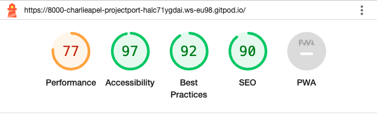
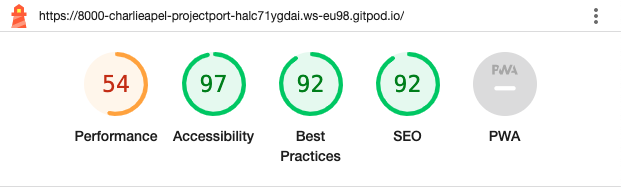
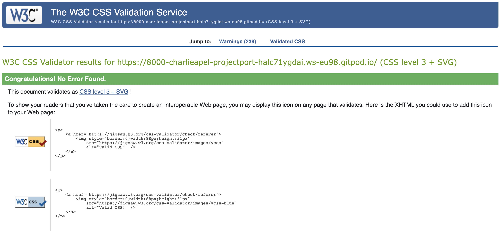

# The Simple Man Spirits - Testing 

[Main README.md file](/README.md)

[View live project](https://pp4-capell.herokuapp.com/)

[View GitHub repository](https://github.com/CharlieApell/ProjectPortfolio4)

***
## Table of contents
- [Performance](#performance)
  - [Google's Lighthouse Performance](#googles-lighthouse-performance)
- [Code Validation](#code-validation)
  - [HTML Validation](#html-validation)
  - [CSS Validation](#css-validation)
  - [PEP8 Validation](#pep8-validation)
- [Testing User Stories](#Testing-User-Stories)
- [Manual Testing](#Manual-Testing)
    - [Common Elements Testing](#common-elements-testing)
    - [Home Page](#home-page)
    - [Recipe Page](#recipe-page)
    - [Sign in/Sign Out/Sign Up/Delete Account Pages](#sign-insign-outsign-updelete-account-pages)
    - [Pages are Responsive](#pages-are-responsive)
    - [Browser Validation](#Browser-Validation)
- [User Testing](#User-Testing)

***

## Performance

### Google's Lighthouse Performance
[Google Lighthouse](https://developers.google.com/web/tools/lighthouse) was used to test the performance of the website. 
There's still a lot I could do to maximize the performance but with the time given and the deadline closing in I had to settle with this.
#### Desktop Results:
.

#### Mobile Results:
.

***

## Code Validation

### HTML Validation
The [W3C Markup Validation Service](https://validator.w3.org/) was used to validate the HTML of the website.
All the Django templates html files hava been manually copying the source of the rendered pages and then validating using the W3C Validator.
 - Result for [home page](./assets/testing/W3C-home-page.png)
 - Result for [recipe page](./assets/testing/W3C-cocktail-page.png)
 - Result for [signup page](./assets/testing/W3C-signup-page.png)
 - Result for [login page](./assets/testing/W3C-login-page.png)
 - Result for [delete account page](./assets/testing/W3C-delete-account-page.png)
 - Result for [search page](./assets/testing/W3C-search-page.png)

 ### CSS Validation 
[Jigsaw CSS validator](https://jigsaw.w3.org/css-validator/) was used for validating the CSS stylesheet. CSS file was tested by manually copying the CSS codes into the manual input option.

.

### PEP8 Python Linter Test
- [PEP8 CI Python Linter](https://pep8ci.herokuapp.com/) and PEP8 Python Validator in GitPod was used to check that the Python code meets PEP8 standards.

* [admin.py](./assets/testing/PEP8-admin-py.png)
* [models.py](./assets/testing/PEP8-models-py.png)
* [forms.py](./assets/testing/PEP8-forms-py.png)
* [urls.py](./assets/testing/PEP8-urls-py.png)
* [views.py](./assets/testing/PEP8-views-py.png)
* [settings.py](./assets/testing/PEP8-settings-py.png)

***

## Testing User Stories

#### User Stories:
1. As a **Site User** I can **view a paginated list of recipes** so that **I can select one to read**. &#x2611;
    - The list of recipes on the home page has been paginated by 21. If there are more than 21 recipes, the remainder moves to the next page. This will continue until there are 21 or less recipe cards on the one page.
 
 

2. As a **Site User** I can **click on a recipe** so that **I can read the full text**. &#x2611;
    - On each recipe card, there is a concise summary of the recipe along with a clickable button that directs the user to the recipe page. There, they can access a comprehensive list of ingredients and the step-by-step method how to make the cocktail.
 
 

3. As a **Site User / Admin** I can **view the number of likes on each recipe** so that **I can see which is the most popular or viral**. &#x2611;
    - The recipe cards display the total number of likes received for each recipe, and this information is also visible on the recipe page itself.
 
 

4. As a **Site User / Admin** I can **view comments on an individual recipe** so that **I can read the conversation**. &#x2611;
    - A comments section has been incorporated into the recipe pages, displaying the author's username and the date/time when the comment was posted.
 
 

5. As a **Site User** I can **register an account** so that **I can comment and like recipes**. &#x2611;
    - The website provides a sign-in and sign-up option, which prompts users on the home page to log in for accessing certain content. Users are required to be signed in to access protected features, such as liking and commenting. Additionally, users have the option to log in using their Google account.
 
 

6. As a **Site User** I can **leave comments on a recipe** so that **I can be involved in the conversation**. &#x2611;
    - A comment section has been incorporated into the recipe pages for users to comment on the recipes.
 
 

7. As a **Site User** I can **like or unlike a recipe** so that **I can interact with the content**. &#x2611;
    - If the user is logged in, they can like or unlike a recipe.
 
 

8. As a **Site User** I can **search for recipes** so that **I find the recipe I'm looking for**. &#x2611;
    - A search field to search for cocktails has been implemented at the top to make it easier to find what you are looking for.
 
 

9. As a **Site Admin** I can **create, read, update and delete recipes** so that **I can manage my content**. &#x2611;
    - As a Site Admin, I have the ability to create, read, update, and delete recipes, enabling me to effectively manage my content..
 
 

10. As a **Site Admin** I can **create draft recipes** so that **I can finish writing the recipes later**. &#x2611;
    - As a Site Admin, I have the capability to create draft recipes, allowing me to save unfinished recipes for completion at a later time.
 
 

11. As a **Site User** I can **delete my account** so that **if I no longer want to be a member I don't have to**. &#x2611;
    - When a user is logged in, they will be able to delete their account.
 
 

12. As a **Site User** I can **share the content** so that **I can post it on my Facebook Page**. &#x2611;
    - If a user wants, they can easily share the recipe to their Facebook Page.
 
 

13. As a **Site User** I can **edit or delete my own comment** so that **I can manage my content**. &#x2611;
    - When a user is logged in and they are the author of a comment, they will see two buttons on the Recipe Detail page. By clicking the blue 'Edit' button, they will be directed to the Edit Comment page, where they can make changes to their comment and resubmit it to the site. 
    By clicking the red "Delete" button will delete the user's comment.
 
 

14. As a **Site Admin** I can **edit or delete comments directly on the recipe page** so that **I don't have to do it through the Admin Page**. &#x2611;
    - As a Site Admin, I have the ability to edit or delete comments directly on the recipe page using two buttons: a blue 'Edit' button and a red 'Delete' button. This enables me to manage comments conveniently without the need to navigate to the Admin Page.
 
 

15. As a **Site User** I can **like or unlike a comment** so that **I can interact with the content**. &#x2612;
    - When a user is logged in they can like or unlike a comment. **(still in progress)**
 
 
[Back to top](#The-Simple-Man-Spirits---Testing)

***

## Manual Testing

During development, I relied on Google developer tools to verify the proper functioning of all components and troubleshoot any unexpected problems.

### Common Elements Testing
Manual testing was performed on the following elements present on each page:

- Test the functionality of the Logo by ensuring it redirects to the home screen.

- Test the navigation links to verify they are working correctly.

- Test the social links to confirm they open in a new page as expected.

### Home Page
Manual testing was conducted on the following elements of the [Home Page](https://pp4-capell.herokuapp.com/):
     
- Test that user welcome message displays username.

    - On logging in, there is a message alert at the top of the Home page which tells the user that they have successfully logged in.

- Test that recipe cards redirect user to recipe pages.

    - The headline, excerpt and image of each recipe card redirects the user to the Recipe Detail page for the recipe they have clicked on.

### Recipe Page
Manual testing was conducted on the following elements of the [Recipe Pages](https://pp4-capell.herokuapp.com/)
     
- Test that recipes can be liked and unliked when logged in.
     
- Test that comments can be submitted.

- Test that comments can be edited by author and admin/superuser only.

- Test that comments can only be deleted by author and admin/superuser only.

- Test that a success message is given when a user deletes or edits a commment.
     
### Sign in/Sign Out/Sign Up/Delete Account Pages
Manual testing was conducted on the following elements of the [Sign In Page](https://pp4-capell.herokuapp.com/accounts/login/), [Sign Out Page](https://pp4-capell.herokuapp.com/accounts/logout/), [Sign Up Page](https://pp4-capell.herokuapp.com/accounts/signup/) and [Delete Account Page](https://pp4-capell.herokuapp.com/delete-account/)

- Users can register, login, logout and delete account.

### Pages are Responsive
- Manual testing was conducted for responsiveness on large, medium and small screens.

[Back to top](#The-Simple-Man-Spirits---Testing)

### Browser Validation
- Chrome
- Safari
- Firefox

[Back to top](#The-Simple-Man-Spirits---Testing)

***